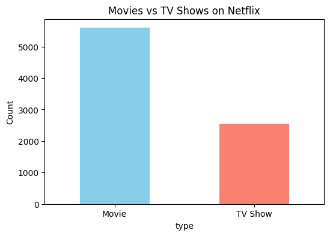
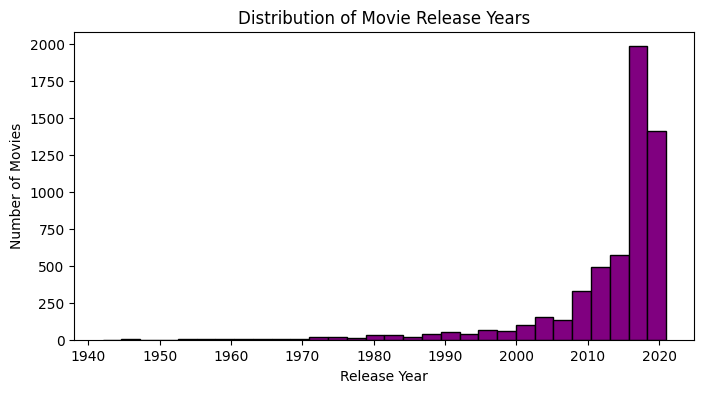
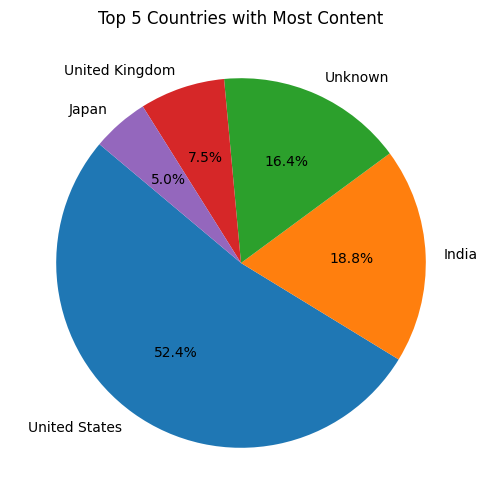
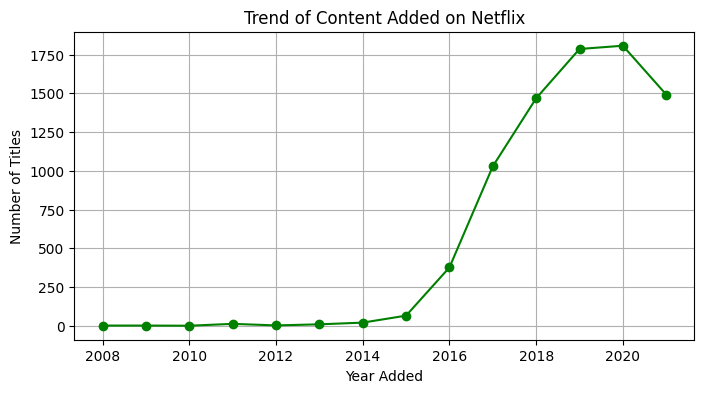
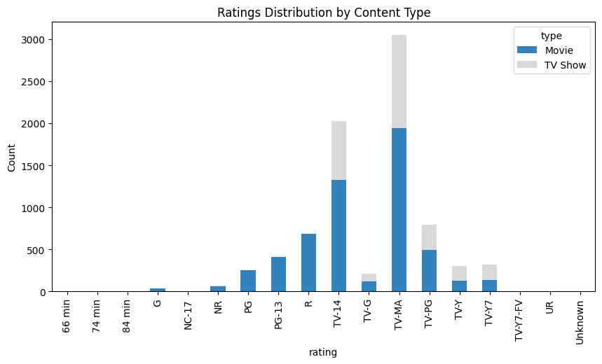
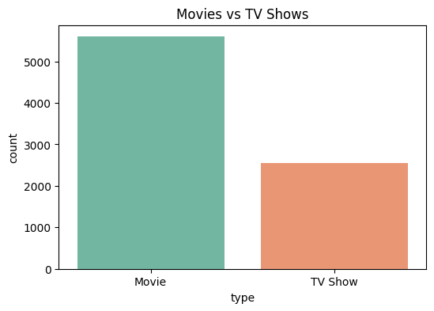
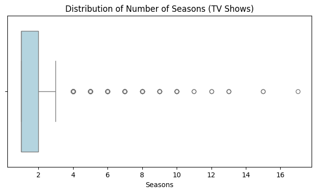
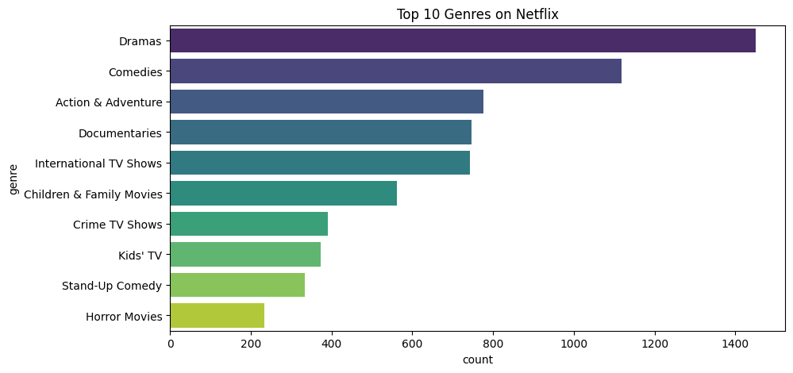
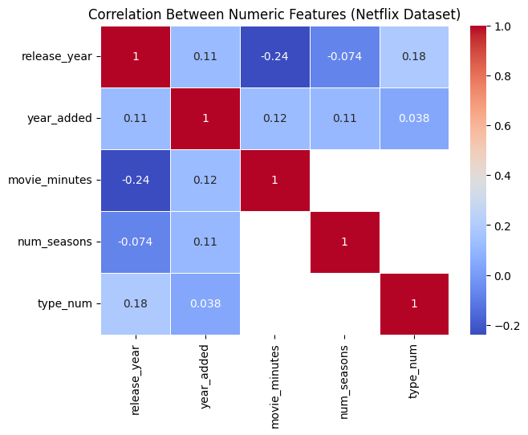
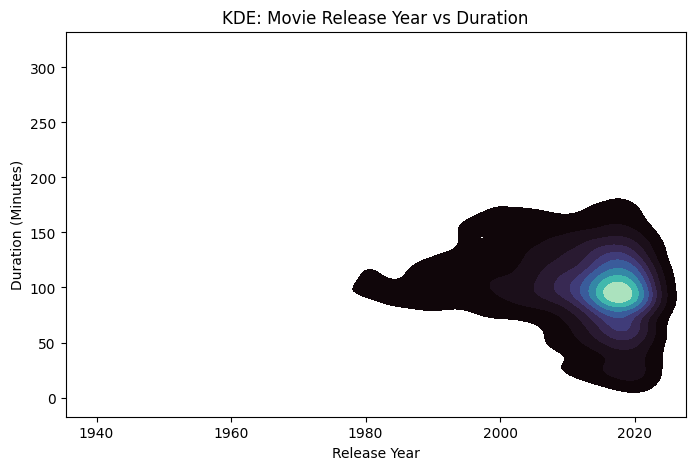

**Netflix Movies and Shows EDA**
This project performs exploratory data analysis (EDA) on the Netflix Movies and Shows dataset sourced from Kaggle, focusing on understanding trends, distributions, and patterns within Netflix's catalog over time.

**Dataset Source**
Dataset: netflix_titles.csv from Kaggle

Features examined: type, title, director, cast, country, date_added, release_year, rating, duration, listed_in, description

**What Was Done**
Imported and inspected the dataset to understand the structure and missing data.

Performed EDA using matplotlib and seaborn for visualization.

Investigated content types, release years, country contributions, trends of added content, and rating distributions.

**MATPLOTLIB PLOTS**

1. Movies vs TV Shows (Bar Plot)
Purpose: Compares the total count of Movies and TV Shows available on Netflix.
Insight: Reveals which type of content is more dominant on the platform.

2. Distribution of Movie Release Years (Histogram)
Purpose: Shows how movies are distributed across release years.
Insight: Identifies whether Netflix's library is skewed towards newly released movies or includes many classics.

3. Top 5 Countries with Most Content (Pie Chart)
Purpose: Visualizes the share of Netflix content from the top five producing countries.
Insight: Highlights the most prominent countries in Netflix’s catalog, showing levels of internationalization.

5. Trend of Content Added Over Years (Line Plot)
Purpose: Shows how many titles were added each year to Netflix.
Insight: Reveals periods of rapid expansion or slowdowns and trends in Netflix’s content growth strategy.

**SEABORN PLOTS**

7. Ratings Distribution by Content Type (Stacked Bar Plot)
Purpose: Compares ratings (TV-MA, PG, etc.) across Movies and TV Shows.
Insight: Highlights the distribution of content maturity and age group focus by type.

8. Movies vs TV Shows (Seaborn Countplot)
Purpose: Provides an alternative visualization for the count of Movies and TV Shows using seaborn.
Insight: Verifies and visually complements the results from the previous bar plot.

9. Distribution of Movie Durations (Histogram + KDE)
Purpose: Displays how movie durations (in minutes) are spread out, including a density curve for better shape analysis.
Insight: Detects if most movies fall within a typical runtime or if there are many outliers (very short or long movies).

10. Number of Seasons in TV Shows (Boxplot)
Purpose: Shows the spread and median of the number of seasons in Netflix TV shows.
Insight: Identifies whether most shows are short series, or if there are many long-running ones.

11. Top 10 Genres on Netflix (Barplot)
Purpose: Displays which genres (first keyword for each) have the most titles on Netflix.
Insight: Reveals popular genres and category focus of Netflix’s content.

12. Correlation Between Numeric Features (Heatmap)
Purpose: Shows how numeric features (release year, year added, duration, number of seasons, type) are correlated.
Insight: Reveals relationships such as whether newer titles tend to be longer, or if more TV shows are added in recent years.

13. Movie Release Year vs Duration (KDE Plot)
Purpose: Kernel Density Estimate plot showing how movie duration varies with release year.
Insight: Helps spot trends such as whether newer movies trend longer or shorter in duration.

